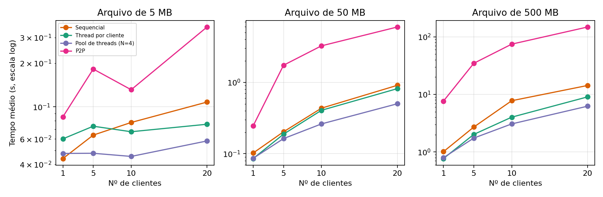
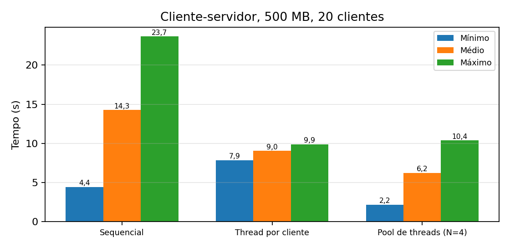

# Cliente-Servidor x P2P: avaliação de desempenho na transferência de arquivos

Atividade 01 –  **Sistemas Distribuídos** 

## Sumário
1. [Sobre a atividade](#sobre-a-atividade)
2. [Estrutura do projeto](#estrutura-do-projeto)
3. [Como funciona](#como-funciona)
4. [Como executar](#como-executar)
5. [Resultados](#resultados)
6. [Análise resumida](#análise-resumida)
7. [Limitações](#limitações)

## Sobre a atividade

O objetivo é avaliar o desempenho da transferência de um arquivo usando quatro arquiteturas:

| # | Arquitetura | Descrição |
|---|---|---|
| 1 | Cliente-servidor sequencial | atende 1 cliente (1 download) por vez |
| 2 | Cliente-servidor com 1 thread por cliente | atende todos os clientes de uma vez |
| 3 | Cliente-servidor com pool de threads | atende no máximo N clientes por vez (N=4 nos testes) |
| 4 | P2P | implementação própria, transferência de 1 máquina para as demais |

Os experimentos variam o **tamanho do arquivo** (5, 50 e 500 MB) e a **quantidade de clientes** (1, 5, 10 e 20) e registram o tempo de conclusão **mínimo, médio e máximo** da transferência. O arquivo baixado é descartado (não é salvo em disco no cliente). O relatório completo está em PDF, entregue à parte no Classroom.

## Estrutura do projeto

```
.
├── common.py        # utilitários (leitura exata do socket, gravação do CSV)
├── servers.py       # servidor cliente-servidor: modos seq, thread e pool
├── client.py        # dispara N clientes simultâneos e mede o tempo de cada um
├── p2p.py           # peer P2P (seed ou leecher)
├── run_p2p.py       # sobe 1 seed + N peers localmente e mede os tempos
├── run_all.py       # roda toda a bateria de experimentos e gera results.csv
├── results.csv      # resultados brutos dos experimentos
└── docs/            # gráficos usados neste README
```

## Como funciona

**Cliente-servidor (`servers.py` + `client.py`).** O cliente conecta por TCP, envia um pedido, recebe 8 bytes com o tamanho do arquivo e depois o conteúdo, que é lido e descartado. O tempo de cada cliente vai do início da conexão ao último byte recebido (inclui a espera na fila). O servidor tem três modos:

- `seq`: trata uma conexão por vez no laço principal; as demais esperam na fila de conexões.
- `thread`: cria uma thread por conexão aceita.
- `pool`: usa um `ThreadPoolExecutor` com N threads; as conexões excedentes esperam na fila do pool.

**P2P (`p2p.py`).** Implementação própria, no estilo BitTorrent:

- O arquivo é dividido em pedaços de 256 KB.
- O *seed* começa com o arquivo completo; os demais peers (*leechers*) começam sem nada.
- Cada peer abre conexões com todos os outros em paralelo, consulta quais pedaços cada um possui, escolhe aleatoriamente um que ainda não tem e o baixa. Ao receber um pedaço, já passa a oferecê-lo aos demais.
- Os pedaços recebidos são gravados em um arquivo temporário (necessário para repassá-los), apagado ao final.
- O tempo de cada peer vai da largada sincronizada até ele possuir todos os pedaços.

Protocolo entre peers: `B` pede o mapa de pedaços; `P` + índice pede um pedaço.

## Como executar

### Requisitos
- Python 3.8 ou superior (testado com 3.13, Windows).
- Nenhuma biblioteca externa para rodar os experimentos.
- Espaço em disco: arquivos de teste de 5, 50 e 500 MB (555 MB) **mais** os arquivos temporários do P2P, que no caso de 500 MB com 20 peers chegam a ~10 GB durante o experimento (são apagados ao final de cada execução).

### 1) Rodar tudo automaticamente (localhost)

```bash
python run_all.py --sizes 5 50 500 --clients 1 5 10 20 --workers 4 --reps 3
```

O script gera os arquivos de teste em `files/`, executa todas as arquiteturas e acrescenta uma linha por experimento em `results.csv`. Opções:

| Opção | Padrão | Descrição |
|---|---|---|
| `--sizes` | `5 50 500` | tamanhos do arquivo, em MB |
| `--clients` | `1 5 10 20` | quantidades de clientes |
| `--modes` | `seq thread pool p2p` | arquiteturas a rodar (`seq`, `thread`, `pool`, `p2p`) |
| `--workers` | `4` | N do pool de threads |
| `--reps` | `1` | repetições de cada experimento |
| `--csv` | `results.csv` | arquivo de saída |

> Para rodar só uma arquitetura, use por exemplo `--modes p2p`. No CSV o pool aparece como `pool4`, porque o rótulo inclui o valor de N.

Exemplo, só o P2P com 500 MB e 20 peers:

```bash
python run_all.py --sizes 500 --clients 20 --modes p2p --reps 3
```

### 2) Rodar manualmente, em máquinas diferentes

Crie um arquivo de teste (exemplo com 50 MB):

```bash
python -c "import os; open('arquivo.bin','wb').write(os.urandom(50*1024*1024))"
```

**Cliente-servidor.** Na máquina do servidor (escolha `seq`, `thread` ou `pool`):

```bash
python servers.py --mode pool --workers 4 --file arquivo.bin --port 5000
```

Nas máquinas clientes:

```bash
python client.py --host IP_DO_SERVIDOR --port 5000 --clients 10 --label pool4 --size-mb 50
```

**P2P.** Na máquina do seed:

```bash
python p2p.py --seed --port 6000 --file arquivo.bin
```

Em cada peer (liste todos os outros, incluindo o seed). `--size` é o tamanho do arquivo em bytes e `--start-at` é o instante de largada, em segundos desde 1970, para sincronizar os peers (os relógios das máquinas devem estar sincronizados):

```bash
python -c "import time; print(int(time.time()) + 20)"          # gera o instante de largada
python -c "import os; print(os.path.getsize('arquivo.bin'))"   # tamanho em bytes
python p2p.py --port 6000 --size BYTES --peers IP_SEED:6000,IP_OUTRO_PEER:6000 --start-at INSTANTE
```

Cada peer imprime `RESULT <segundos>` ao concluir. Em redes reais, libere as portas usadas no firewall (no Windows, permita o Python na primeira execução).

### 3) Formato do `results.csv`

`modo,tamanho_mb,clientes,concluidos,min_s,medio_s,max_s`: uma linha por execução, com o mínimo, o médio e o máximo entre os clientes (ou peers) daquela execução.

## Resultados

Todos os experimentos foram executados em **uma única máquina** (Windows, Python 3.13), com servidor e clientes/peers locais comunicando-se por loopback. Cada valor abaixo é a média das repetições (em geral 6; entre 3 e 7). No P2P, "clientes" é o número de peers que baixam (mais 1 seed).



*Tempo médio de conclusão por número de clientes (escala logarítmica).*



*Variações cliente-servidor com 500 MB e 20 clientes: mínimo, médio e máximo.*

### Tempo médio de conclusão

**Arquivo de 5 MB – tempo médio (s)**

| Clientes | Sequencial | Thread por cliente | Pool (N=4) | P2P |
|---:|---:|---:|---:|---:|
| 1 | 0,04 | 0,06 | 0,05 | 0,09 |
| 5 | 0,06 | 0,07 | 0,05 | 0,18 |
| 10 | 0,08 | 0,07 | 0,05 | 0,13 |
| 20 | 0,11 | 0,08 | 0,06 | 0,35 |

**Arquivo de 50 MB – tempo médio (s)**

| Clientes | Sequencial | Thread por cliente | Pool (N=4) | P2P |
|---:|---:|---:|---:|---:|
| 1 | 0,10 | 0,09 | 0,09 | 0,25 |
| 5 | 0,20 | 0,19 | 0,16 | 1,74 |
| 10 | 0,43 | 0,41 | 0,26 | 3,25 |
| 20 | 0,91 | 0,82 | 0,50 | 5,96 |

**Arquivo de 500 MB – tempo médio (s)**

| Clientes | Sequencial | Thread por cliente | Pool (N=4) | P2P |
|---:|---:|---:|---:|---:|
| 1 | 1,01 | 0,77 | 0,80 | 7,64 |
| 5 | 2,71 | 2,02 | 1,74 | 34,65 |
| 10 | 7,76 | 4,02 | 3,07 | 74,53 |
| 20 | 14,28 | 9,05 | 6,23 | 147,84 |

<details>
<summary>Tabelas completas (mínimo, médio e máximo)</summary>

**5 MB**

| Clientes | Arquitetura | Mínimo (s) | Médio (s) | Máximo (s) |
|---:|---|---:|---:|---:|
| 1 | Sequencial | 0,04 | 0,04 | 0,04 |
| 1 | Thread por cliente | 0,06 | 0,06 | 0,06 |
| 1 | Pool (N=4) | 0,05 | 0,05 | 0,05 |
| 1 | P2P | 0,09 | 0,09 | 0,09 |
| 5 | Sequencial | 0,03 | 0,06 | 0,10 |
| 5 | Thread por cliente | 0,05 | 0,07 | 0,10 |
| 5 | Pool (N=4) | 0,04 | 0,05 | 0,06 |
| 5 | P2P | 0,16 | 0,18 | 0,20 |
| 10 | Sequencial | 0,02 | 0,08 | 0,13 |
| 10 | Thread por cliente | 0,06 | 0,07 | 0,08 |
| 10 | Pool (N=4) | 0,03 | 0,05 | 0,06 |
| 10 | P2P | 0,10 | 0,13 | 0,16 |
| 20 | Sequencial | 0,02 | 0,11 | 0,20 |
| 20 | Thread por cliente | 0,05 | 0,08 | 0,10 |
| 20 | Pool (N=4) | 0,02 | 0,06 | 0,09 |
| 20 | P2P | 0,33 | 0,35 | 0,36 |

**50 MB**

| Clientes | Arquitetura | Mínimo (s) | Médio (s) | Máximo (s) |
|---:|---|---:|---:|---:|
| 1 | Sequencial | 0,10 | 0,10 | 0,10 |
| 1 | Thread por cliente | 0,09 | 0,09 | 0,09 |
| 1 | Pool (N=4) | 0,09 | 0,09 | 0,09 |
| 1 | P2P | 0,25 | 0,25 | 0,25 |
| 5 | Sequencial | 0,08 | 0,20 | 0,32 |
| 5 | Thread por cliente | 0,18 | 0,19 | 0,19 |
| 5 | Pool (N=4) | 0,15 | 0,16 | 0,22 |
| 5 | P2P | 1,67 | 1,74 | 1,78 |
| 10 | Sequencial | 0,14 | 0,43 | 0,72 |
| 10 | Thread por cliente | 0,38 | 0,41 | 0,42 |
| 10 | Pool (N=4) | 0,15 | 0,26 | 0,41 |
| 10 | P2P | 2,25 | 3,25 | 4,07 |
| 20 | Sequencial | 0,21 | 0,91 | 1,53 |
| 20 | Thread por cliente | 0,74 | 0,82 | 0,86 |
| 20 | Pool (N=4) | 0,16 | 0,50 | 0,86 |
| 20 | P2P | 0,45 | 5,96 | 9,25 |

**500 MB**

| Clientes | Arquitetura | Mínimo (s) | Médio (s) | Máximo (s) |
|---:|---|---:|---:|---:|
| 1 | Sequencial | 1,01 | 1,01 | 1,01 |
| 1 | Thread por cliente | 0,77 | 0,77 | 0,77 |
| 1 | Pool (N=4) | 0,80 | 0,80 | 0,80 |
| 1 | P2P | 7,64 | 7,64 | 7,64 |
| 5 | Sequencial | 1,37 | 2,71 | 4,00 |
| 5 | Thread por cliente | 1,99 | 2,02 | 2,05 |
| 5 | Pool (N=4) | 1,60 | 1,74 | 2,26 |
| 5 | P2P | 32,31 | 34,65 | 36,09 |
| 10 | Sequencial | 4,24 | 7,76 | 11,07 |
| 10 | Thread por cliente | 3,78 | 4,02 | 4,20 |
| 10 | Pool (N=4) | 1,88 | 3,07 | 4,56 |
| 10 | P2P | 63,41 | 74,53 | 82,48 |
| 20 | Sequencial | 4,44 | 14,28 | 23,65 |
| 20 | Thread por cliente | 7,85 | 9,05 | 9,90 |
| 20 | Pool (N=4) | 2,18 | 6,23 | 10,37 |
| 20 | P2P | 106,85 | 147,84 | 175,60 |

</details>

## Análise resumida

- **Cliente-servidor:** com 1 cliente as três variações são equivalentes. Com 500 MB e 20 clientes, o **pool** teve a melhor média (6,23 s), a **thread por cliente** teve tempos muito homogêneos (mínimo 7,85 s, máximo 9,90 s) e o **sequencial** teve a pior média (14,28 s) e a maior dispersão (de 4,44 s a 23,65 s) por causa da fila.
- **P2P:** foi sensivelmente mais lento neste ambiente (cerca de 24 vezes a melhor média cliente-servidor com 500 MB e 20 clientes). Isso reflete as condições do teste: todos os peers dividem a mesma CPU, o mesmo disco e o mesmo loopback, não há banda extra para aproveitar, e a implementação tem overhead (Python, protocolo por pedaço, gravação em disco dos pedaços).
- **Vantagem teórica do P2P:** no cliente-servidor, a banda de saída do servidor é dividida entre os clientes; no P2P, cada peer que recebe pedaços também os envia. Esse benefício precisa de máquinas e enlaces distintos e **não foi verificado** neste trabalho.

## Limitações

- Testes em uma única máquina e via loopback, sem rede real; isso favorece o cliente-servidor e penaliza o P2P.
- Os arquivos podem ter sido servidos do cache do sistema operacional.
- Variabilidade alta entre repetições, principalmente no P2P e nos arquivos de 5 MB (tempos de poucas dezenas de milissegundos). O caso P2P com 500 MB e 20 peers teve apenas 3 repetições.
- A implementação P2P é simples (sem otimizações como a escolha do pedaço mais raro).
